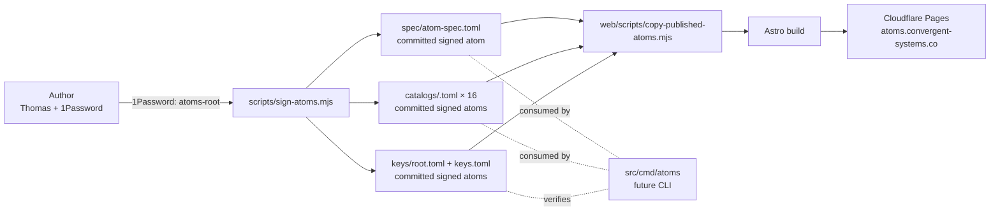

# Architecture

The `atoms` umbrella repository is the catalog-of-catalogs for the
`*-atoms` ecosystem. It hosts the canonical Atom Spec, the catalog
registry, and trust roots at `atoms.convergent-systems.co`.

See `spec/atom-spec.md` for the normative Spec and `docs/adr/` for
individual architecture decisions.

## Repository layout

```
spec/                   Canonical Spec source + signed atom outputs
  atom-spec.md            normative markdown (committed source of truth)
  atom-spec.toml          signed atom (committed; output of sign-atoms.mjs)
  atom-spec@1.0.0.toml    version-pinned alias (committed)
  index.toml              spec class index (signed)

catalogs/               Signed catalog registry atoms (one per catalog)
  <catalog>.toml          Spec §32 registry entry (signed)
  index.toml              registry class index (signed)

keys/                   Trust root records
  root.toml               root key public material (self-signed)
  index.toml              keys class index (signed)
keys.toml                 umbrella key registry (Spec §20, signed)

src/                    Source — Go + git submodules
  cmd/atoms/              `atoms` CLI binary (slice 4 — implementation pending)
  internal/               internal Go packages (not importable externally)
  pkg/                    public Go packages
  plugins/                Go-loadable plugins (deferred)
  <catalog>-atoms/        × 16 — git submodule per registered catalog

web/                    Front-end (Astro static site)
  src/pages/              /, /spec/, /catalogs/, /keys/, /how-to-use/
  scripts/                build-directory.mjs + copy-published-atoms.mjs

infra/terraform/        Infrastructure-as-code (multi-env)
  modules/pages-project/  Cloudflare Pages module
  envs/{dev,prod}/        per-environment composition

scripts/                Project tooling
  keygen-root.mjs         one-shot root-key generation → 1Password
  sign-atoms.mjs          re-sign Spec + registry + key records
  lib/canonical-toml.mjs  deterministic TOML serializer (Spec §6)
  lib/sign-ed25519.mjs    Ed25519 + 1Password bridge

docs/adr/               MADR-format architecture decisions
```

## High-level component view



## Trust

Per Spec Part IX §40, the bootstrap root key is held in 1Password
(`Convergent Systems LLC / atoms-root`). It signs the Spec atom, the 16
catalog registry atoms, the keys class index, and the umbrella key
registry. Signatures are computed over the SHA-256 of the canonical
TOML form (with the `[signatures]` table excluded) per Spec §6.

CI never holds the private key. Signing is a local-only operation
performed by the author against 1Password. Signed atoms are committed
sources of truth; the web build only copies them.

## Conventions

- **Conventional Commits.** See `CONTRIBUTING.md`.
- **MADR ADRs.** New significant decisions land in `docs/adr/<NNNN>-<slug>.md`.
- **Apache-2.0 license.** See `LICENSE`. Per-catalog licensing matches the
  ecosystem convention; the `*-atoms` repos are also Apache-2.0.
- **One bundle per concern.** Releases, ADRs, and Spec versions evolve
  on their own SemVer rails; see `CHANGELOG.md`.
