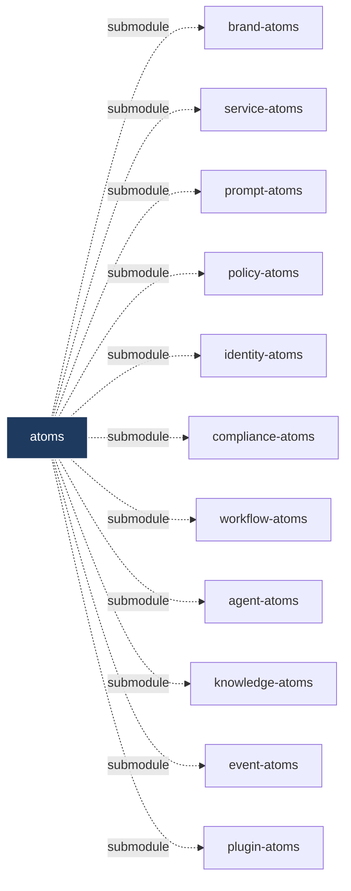

# atoms

> Umbrella super-project for every `*-Atoms` catalog in the [Convergent Systems](https://xdao.co) ecosystem.

`atoms` is not a monorepo. Each catalog remains its own independent repository — donatable, transferable, federatable, with its own release cycle and contributor community. `atoms` is a thin umbrella that pins a known-good revision of every catalog as a git submodule, so a single clone gives you the whole ecosystem in one tree.

> Architectural principle (from `aish/ARCHITECTURE.md`): *"each `*-Atoms` catalog is its own repository. Not a monorepo."* Submodules preserve that — catalogs stay decentralized; this repo just provides an umbrella view.

## What's in here



| Catalog | Status | What it catalogs |
|---|---|---|
| [`brand-atoms`](./brand-atoms) | Existing | Brand standards — palettes, fonts, glyphs, brand compositions |
| [`service-atoms`](./service-atoms) | Bootstrap | Ecosystem-native services — identities, protocols, schemas, policies, endpoints |
| [`prompt-atoms`](./prompt-atoms) | Bootstrap | LLM prompt fragments — personas, constraints, formats, tool-use, refusal patterns |
| [`policy-atoms`](./policy-atoms) | Bootstrap | Governance rules — subjects, resources, actions, effects, conditions |
| [`identity-atoms`](./identity-atoms) | Bootstrap | Identity primitives — auth methods, claims, trust frameworks, keys |
| [`compliance-atoms`](./compliance-atoms) | Bootstrap | Compliance frameworks — SOC2, HIPAA, ISO27001, PCI, GDPR mapped once |
| [`workflow-atoms`](./workflow-atoms) | Bootstrap | Workflow primitives — steps, triggers, states, gates |
| [`agent-atoms`](./agent-atoms) | Bootstrap | AI agent primitives — personas, tools, capabilities, role boundaries |
| [`knowledge-atoms`](./knowledge-atoms) | Bootstrap | Knowledge graph primitives — entities, relationships, provenance |
| [`event-atoms`](./event-atoms) | Bootstrap | Event primitives — types, schemas, channels, delivery semantics |
| [`plugin-atoms`](./plugin-atoms) | Bootstrap | Plugin interface standards — contracts, capabilities, lifecycle hooks |

## Clone with submodules

```bash
git clone --recurse-submodules https://github.com/convergent-systems-co/atoms.git
# or, after a plain clone:
cd atoms && git submodule update --init --recursive
```

## Update every catalog to its latest main

```bash
git submodule update --remote --merge
git add .
git commit -m "chore: bump submodule pointers"
git push
```

## Working on a single catalog

Each submodule is a real git repo. `cd` into it, branch, commit, push — the changes land in the catalog's own repository. Then commit the updated submodule pointer here.

```bash
cd prompt-atoms
git checkout -b feat/new-persona
# edit, commit, push, open PR against prompt-atoms
cd ..
git add prompt-atoms
git commit -m "chore: bump prompt-atoms to <sha>"
```

## Related repos (peers in the ecosystem)

These are **not** submodules of `atoms` — they're federation infrastructure that operates *on* the catalogs:

- **[xdao](https://github.com/convergent-systems-co/xdao)** — Federation portal source. The ecosystem directory at [xdao.co](https://xdao.co).
- **[atoms-spec](https://github.com/convergent-systems-co/atoms-spec)** — Canonical JSON Schemas every catalog conforms to.
- **[atoms-tools](https://github.com/convergent-systems-co/atoms-tools)** — Cross-platform CLI: validate, export, bootstrap, resolve.
- **[xaips](https://github.com/convergent-systems-co/xaips)** — XDAO AI Improvement Proposals. RFC-style governance.

And these are **runtimes** that consume the catalogs:

- **[aish](https://github.com/convergent-systems-co/aish)** — AI-native, shell-native, OS-insensitive, fully reversible shell.
- **olympus** — AI development runtime (Pantheon Modules, governance panels, agentic loop).
- **universal-bus** — Future service-layer runtime.

## Civilization-grade properties

Every catalog in here satisfies these. Failing any of them in CI blocks merge.

| Property | Validation |
|---|---|
| Typed | Every atom, composition, and rule validates against a JSON Schema |
| Versioned | Every atom has a semver `version` field |
| Machine-readable | `catalog.json` export is valid JSON parseable without manual intervention |
| Composable | Compositions reference atoms by ID; references resolve; circular refs forbidden |
| Open | LICENSE file is OSI-approved (Apache-2.0 default) |
| Durable | No external dependencies that could disappear |

## License

Apache-2.0 — see [`LICENSE`](./LICENSE). Each submodule carries its own Apache-2.0 license.
